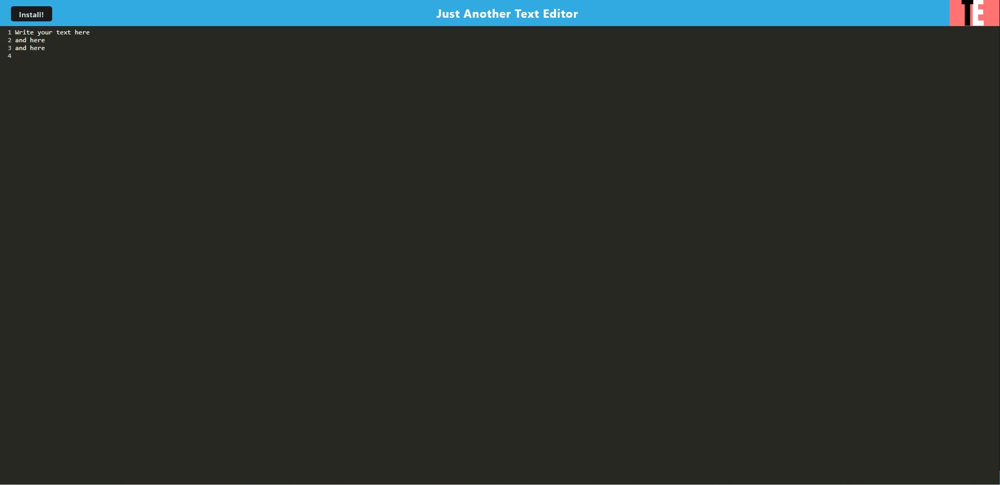

# PWA Text Editor

# Table of Contents

1. [Description](#description)
2. [License](#license)
3. [Installation](#installation)
4. [Usage](#usage)
5. [Link](#link)
6. [Screenshots](#screenshots)

## Description
The PWA Text Editor lets a user write out text as a text editor. It uses local storage and indexedDB to store the data both online and offline. It uses codemirror as the text editor and is equipped with PWA capability to allow downloads.

## License
Licensed under the The MIT License    
          

## Installation
Run `npm i` to install the correct packages. Then, run the command `npm run start` to start the server and run the build for the client                

## Usage
Use this app as a basic text editor. Download the app for use without internet connection. 

## Link

## Screenshots

